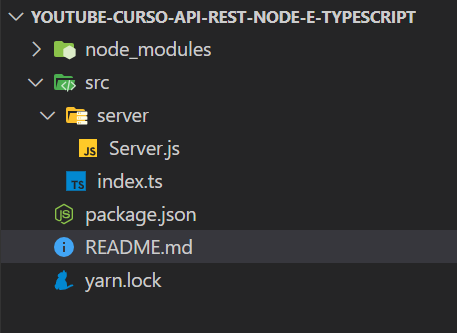

# Building RESTful Web APIs with Node.js, Express, MongoDB and TypeScript

Canal do Youtube: https://www.youtube.com/watch?v=SVepTuBK4V0&list=PL29TaWXah3iaaXDFPgTHiFMBF6wQahurP

---

### **Aula #03 - API Rest, Node e Typescript**

> Ao executar o comando "yarn init -y" ele cria automaticamente um arquivo - package.json no diretório atual com configurações padrão. O package.json é um arquivo de manifesto para projetos Node.js, onde você especifica metadados do projeto, dependências, scripts de execução e outras informações importantes.

```
D:\> yarn init -y
yarn init v1.22.19
warning The yes flag has been set. This will automatically answer yes to all questions, which may have security implications.
success Saved - package.json
Done in 0.07s.
```

- **<mark>package.json**</mark>

```
{
  "name": "youtube-curso-api-rest-node-e-typescript",
  "version": "1.0.0",
  "main": "index.js",
  "license": "MIT"
}

```

> Ao executar o comando "yarn add express", o Yarn irá baixar e instalar a última versão estável do pacote "express" a partir do registro de pacotes npm. O Express é um framework web para Node.js que simplifica o desenvolvimento de aplicativos web, proporcionando uma estrutura simples e eficiente para lidar com rotas, middlewares, e outros aspectos comuns em aplicações web.

```
D:\> yarn add express
yarn add v1.22.19
info No lockfile found.
[1/4] Resolving packages...
[2/4] Fetching packages...
[3/4] Linking dependencies...
[4/4] Building fresh packages...
success Saved lockfile.
success Saved 37 new dependencies.
info Direct dependencies
└─ express@4.18.2
info All dependencies
├─ accepts@1.3.8
├─ array-flatten@1.1.1
├─ body-parser@1.20.1
├─ call-bind@1.0.5
├─ content-disposition@0.5.4
├─ cookie-signature@1.0.6
├─ cookie@0.5.0
├─ define-data-property@1.1.1
├─ ee-first@1.1.1
├─ express@4.18.2
├─ finalhandler@1.2.0
├─ forwarded@0.2.0
├─ get-intrinsic@1.2.2
├─ has-proto@1.0.1
├─ has-symbols@1.0.3
├─ hasown@2.0.0
├─ inherits@2.0.4
├─ ipaddr.js@1.9.1
├─ media-typer@0.3.0
├─ merge-descriptors@1.0.1
├─ methods@1.1.2
├─ mime-db@1.52.0
├─ mime-types@2.1.35
├─ mime@1.6.0
├─ ms@2.0.0
├─ negotiator@0.6.3
├─ object-inspect@1.13.1
├─ path-to-regexp@0.1.7
├─ proxy-addr@2.0.7
├─ raw-body@2.5.1
├─ safer-buffer@2.1.2
├─ serve-static@1.15.0
├─ set-function-length@1.1.1
├─ side-channel@1.0.4
├─ toidentifier@1.0.1
├─ utils-merge@1.0.1
└─ vary@1.1.2
Done in 7.76s.
```

- package.json

```
{
  "name": "youtube-curso-api-rest-node-e-typescript",
  "version": "1.0.0",
  "main": "index.js",
  "license": "MIT",
  "dependencies": {
    "express": "^4.18.2"
}
```

> O comando "yarn add -D typescript @types/express ts-node-dev" é utilizado para adicionar algumas dependências ao seu projeto Node.js, especialmente quando se está trabalhando com TypeScript.

> > yarn add: Este é o comando do gerenciador de pacotes Yarn para adicionar dependências ao seu projeto.

> > -D (ou --dev): Isso indica que as dependências a serem instaladas são do tipo desenvolvimento, ou seja, elas são necessárias apenas durante o desenvolvimento do projeto e não são necessárias para a execução do código em um ambiente de produção.

> > typescript: Esta é a dependência principal que você está adicionando ao projeto. O TypeScript é um superset do JavaScript que adiciona tipagem estática ao código, permitindo um desenvolvimento mais robusto e detectando erros em tempo de compilação.

> > @types/express: O Express é um framework para construção de aplicativos web com Node.js. Quando você está usando TypeScript, é necessário instalar também os tipos de definição para o Express, que estão disponíveis no pacote @types/express. Isso permite que o TypeScript compreenda e forneça sugestões de código para as APIs do Express.

> > ts-node-dev: Este é um utilitário para o desenvolvimento em TypeScript que facilita a execução de aplicativos TypeScript com recarga automática. Ele é particularmente útil durante o desenvolvimento, pois reinicia automaticamente o servidor sempre que há alterações no código fonte, eliminando a necessidade de reiniciar manualmente o servidor a cada alteração.

```
D:\> yarn add -D typescript @types/express ts-node-dev
yarn add v1.22.19
[1/4] Resolving packages...
[2/4] Fetching packages...
[3/4] Linking dependencies...
warning "ts-node-dev > ts-node@10.9.1" has unmet peer dependency "@types/node@*".
[4/4] Building fresh packages...

success Saved lockfile.
success Saved 69 new dependencies.
info Direct dependencies
├─ @types/express@4.17.21
├─ ts-node-dev@2.0.0
└─ typescript@5.3.2
info All dependencies
├─ @cspotcode/source-map-support@0.8.1
├─ @jridgewell/resolve-uri@3.1.1
├─ @jridgewell/sourcemap-codec@1.4.15
├─ @jridgewell/trace-mapping@0.3.9
├─ @tsconfig/node10@1.0.9
├─ @tsconfig/node12@1.0.11
├─ @tsconfig/node14@1.0.3
├─ @tsconfig/node16@1.0.4
├─ @types/body-parser@1.19.5
├─ @types/connect@3.4.38
├─ @types/express-serve-static-core@4.17.41
├─ @types/express@4.17.21
├─ @types/http-errors@2.0.4
├─ @types/mime@3.0.4
├─ @types/range-parser@1.2.7
├─ @types/send@0.17.4
├─ @types/serve-static@1.15.5
├─ @types/strip-bom@3.0.0
├─ @types/strip-json-comments@0.0.30
├─ acorn-walk@8.3.0
├─ acorn@8.11.2
├─ anymatch@3.1.3
├─ arg@4.1.3
├─ balanced-match@1.0.2
├─ binary-extensions@2.2.0
├─ brace-expansion@1.1.11
├─ braces@3.0.2
├─ buffer-from@1.1.2
├─ chokidar@3.5.3
├─ concat-map@0.0.1
├─ create-require@1.1.1
├─ diff@4.0.2
├─ dynamic-dedupe@0.3.0
├─ fill-range@7.0.1
├─ fs.realpath@1.0.0
├─ glob-parent@5.1.2
├─ glob@7.2.3
├─ inflight@1.0.6
├─ is-binary-path@2.1.0
├─ is-core-module@2.13.1
├─ is-extglob@2.1.1
├─ is-glob@4.0.3
├─ is-number@7.0.0
├─ make-error@1.3.6
├─ minimatch@3.1.2
├─ minimist@1.2.8
├─ mkdirp@1.0.4
├─ normalize-path@3.0.0
├─ path-is-absolute@1.0.1
├─ path-parse@1.0.7
├─ picomatch@2.3.1
├─ readdirp@3.6.0
├─ resolve@1.22.8
├─ rimraf@2.7.1
├─ source-map-support@0.5.21
├─ source-map@0.6.1
├─ strip-bom@3.0.0
├─ strip-json-comments@2.0.1
├─ supports-preserve-symlinks-flag@1.0.0
├─ to-regex-range@5.0.1
├─ tree-kill@1.2.2
├─ ts-node-dev@2.0.0
├─ ts-node@10.9.1
├─ tsconfig@7.0.0
├─ typescript@5.3.2
├─ undici-types@5.26.5
├─ v8-compile-cache-lib@3.0.1
├─ xtend@4.0.2
└─ yn@3.1.1
Done in 15.27s.
```

- package.json

```
{
  "name": "youtube-curso-api-rest-node-e-typescript",
  "version": "1.0.0",
  "main": "index.js",
  "license": "MIT",
  "dependencies": {
    "express": "^4.18.2"
  },
  "devDependencies": {
    "@types/express": "^4.17.21",
    "ts-node-dev": "^2.0.0",
    "typescript": "^5.3.2"
  }
}
```


---

### **Aula #04 - Métodos HTTP e ferramentas para testar API Rest**

> O comando "npx eslint --init" é utilizado para inicializar a configuração de um projeto, é uma ferramenta para você definir as regras e te mostrar eventualmente códigos que estão fora das regras de padronização já definidas pela sua equipe. É criado o arquivo eslintrc.json

```
npx eslint --init
You can also run this command directly using 'npm init @eslint/config'.
√ How would you like to use ESLint? · style
√ What type of modules does your project use? · esm
√ Which framework does your project use? · none
√ Does your project use TypeScript? · No / Yes
√ Where does your code run? · browser, node
√ How would you like to define a style for your project? · prompt
√ What format do you want your config file to be in? · JSON
√ What style of indentation do you use? · 4
√ What quotes do you use for strings? · single
√ What line endings do you use? · unix
√ Do you require semicolons? · No / Yes
Local ESLint installation not found.
The config that you've selected requires the following dependencies:

@typescript-eslint/eslint-plugin@latest @typescript-eslint/parser@latest eslint@latest
√ Would you like to install them now? · No / Yes
√ Which package manager do you want to use? · yarn
Installing @typescript-eslint/eslint-plugin@latest, @typescript-eslint/parser@latest, eslint@latest
yarn add v1.22.19
[1/4] Resolving packages...
[2/4] Fetching packages...
[3/4] Linking dependencies...
warning "ts-node-dev > ts-node@10.9.1" has unmet peer dependency "@types/node@*".
[4/4] Building fresh packages...

success Saved lockfile.
success Saved 85 new dependencies.
info Direct dependencies
├─ @typescript-eslint/eslint-plugin@6.13.1
├─ @typescript-eslint/parser@6.13.1
└─ eslint@8.55.0
info All dependencies
├─ @aashutoshrathi/word-wrap@1.2.6
├─ @eslint-community/eslint-utils@4.4.0
├─ @eslint-community/regexpp@4.10.0
├─ @eslint/eslintrc@2.1.4
├─ @eslint/js@8.55.0
├─ @humanwhocodes/config-array@0.11.13
├─ @humanwhocodes/module-importer@1.0.1
├─ @humanwhocodes/object-schema@2.0.1
├─ @nodelib/fs.scandir@2.1.5
├─ @nodelib/fs.stat@2.0.5
├─ @nodelib/fs.walk@1.2.8
├─ @types/json-schema@7.0.15
├─ @types/semver@7.5.6
├─ @typescript-eslint/eslint-plugin@6.13.1
├─ @typescript-eslint/parser@6.13.1
├─ @typescript-eslint/type-utils@6.13.1
├─ @ungap/structured-clone@1.2.0
├─ acorn-jsx@5.3.2
├─ ansi-regex@5.0.1
├─ ansi-styles@4.3.0
├─ argparse@2.0.1
├─ array-union@2.1.0
├─ callsites@3.1.0
├─ chalk@4.1.2
├─ color-convert@2.0.1
├─ color-name@1.1.4
├─ cross-spawn@7.0.3
├─ deep-is@0.1.4
├─ dir-glob@3.0.1
├─ doctrine@3.0.0
├─ escape-string-regexp@4.0.0
├─ eslint-scope@7.2.2
├─ eslint@8.55.0
├─ espree@9.6.1
├─ esquery@1.5.0
├─ esrecurse@4.3.0
├─ fast-deep-equal@3.1.3
├─ fast-glob@3.3.2
├─ fast-json-stable-stringify@2.1.0
├─ fast-levenshtein@2.0.6
├─ fastq@1.15.0
├─ file-entry-cache@6.0.1
├─ find-up@5.0.0
├─ flat-cache@3.2.0
├─ flatted@3.2.9
├─ globby@11.1.0
├─ has-flag@4.0.0
├─ import-fresh@3.3.0
├─ imurmurhash@0.1.4
├─ is-path-inside@3.0.3
├─ isexe@2.0.0
├─ json-buffer@3.0.1
├─ json-schema-traverse@0.4.1
├─ json-stable-stringify-without-jsonify@1.0.1
├─ keyv@4.5.4
├─ locate-path@6.0.0
├─ lodash.merge@4.6.2
├─ lru-cache@6.0.0
├─ merge2@1.4.1
├─ micromatch@4.0.5
├─ ms@2.1.2
├─ optionator@0.9.3
├─ p-limit@3.1.0
├─ p-locate@5.0.0
├─ parent-module@1.0.1
├─ path-exists@4.0.0
├─ path-key@3.1.1
├─ path-type@4.0.0
├─ punycode@2.3.1
├─ queue-microtask@1.2.3
├─ resolve-from@4.0.0
├─ reusify@1.0.4
├─ run-parallel@1.2.0
├─ shebang-command@2.0.0
├─ shebang-regex@3.0.0
├─ slash@3.0.0
├─ strip-ansi@6.0.1
├─ supports-color@7.2.0
├─ text-table@0.2.0
├─ type-check@0.4.0
├─ type-fest@0.20.2
├─ uri-js@4.4.1
├─ which@2.0.2
├─ yallist@4.0.0
└─ yocto-queue@0.1.0
Done in 26.19s.
Successfully created .eslintrc.json file in D:\\api-rest-node-e-typescript
```

- **<mark>eslintrc.json</mark>**

```
{
    "env": {
        "browser": true,
        "es2021": true,
        "node": true
    },
    "extends": [
        "eslint:recommended",
        "plugin:@typescript-eslint/recommended"
    ],
    "parser": "@typescript-eslint/parser",
    "parserOptions": {
        "ecmaVersion": "latest",
        "sourceType": "module"
    },
    "plugins": [
        "@typescript-eslint"
    ],
    "rules": {
        "indent": [
            "error",
            4
        ],
        "linebreak-style": [
            "error",
            "unix"
        ],
        "quotes": [
            "error",
            "single"
        ],
        "semi": [
            "error",
            "never"
        ]
    }
}

```

> Inserir as configurações desejadas no arquivo .editorConfig


- **<mark>.editorConfig**</mark>

```

# EditorConfig is awesome: https://EditorConfig.org

# top-most EditorConfig file
root = true

[*]
indent_style = space
indent_size = 2
end_of_line = lf
charset = utf-8
trim_trailing_whitespace = false
insert_final_newline = false
```


- **<mark>src/server/Server.js**</mark>

```
import express from 'express'

const server = express()

server.get('/', (req, res) => {
    return res.send('Olá Dev!')
})

export { server }
```

- **<mark>src/index.js**</mark>

```
import { server } from './server/Server'

server.listen(3333, () => console.log('Bem vindo ao typescript!'))
```

> Comando para rodar o servidor de desenvolvimento "ts-node-dev"

```
yarn ts-node-dev src/index.ts
yarn run v1.22.19
$ D:\\api-rest-node-e-typescript\node_modules\.bin\ts-node-dev src/index.ts
[INFO] 20:59:38 ts-node-dev ver. 2.0.0 (using ts-node ver. 10.9.1, typescript ver. 5.3.2)
Bem vindo ao typescript!
```

---

### **Aula #05 - Endpoints e status codes**

> Instalar a biblioteca http-status-codes para receber o código de status http no cliente Insomnia.

```
yarn add  http-status-codes
yarn add v1.22.19
[2/4] Fetching packages...
[3/4] Linking dependencies...
warning "ts-node-dev > ts-node@10.9.1" has unmet peer dependency "@types/node@*".
[4/4] Building fresh packages...

success Saved lockfile.
success Saved 1 new dependency.
info Direct dependencies
└─ http-status-codes@2.3.0
info All dependencies
└─ http-status-codes@2.3.0
Done in 4.96s.
```

> Ao solicitar a url da API a bliblioteca http-status-codes retorna o código de status, números de três dígitos que indicam o resultado de uma solicitação HTTP. O servidor recebe os cabeçalhos da solicitação e o cliente deve prosseguir para enviar o corpo da solicitação. Os códigos de status HTTP mais comuns e seus significados:

- Sucesso 2xx:

200 OK: A solicitação foi bem-sucedida.
201 Criado: a solicitação foi bem-sucedida e um recurso foi criado.

- Erros do cliente 4xx:

400 Bad Request: O servidor não entendeu a solicitação.
401 Não autorizado: a autenticação é necessária e falhou ou faltam credenciais.
403 Proibido: O servidor entendeu a solicitação, mas se recusa a autorizá-la.
404 Not Found: O recurso solicitado não foi encontrado no servidor.

- Erros de servidor 5xx:

500 Erro interno do servidor: uma mensagem de erro genérica retornada quando uma condição inesperada foi encontrada.



---

### **Aula #06 - Variáveis ambiente e build"**

> Dotenv é um módulo de dependência que carrega variáveis ​​de ambiente. O arquivo .env, armazena as configurações de ambiente, arquivo do tipo chave valor.

```
yarn add dotenv
yarn add v1.22.19
[1/4] Resolving packages...
[2/4] Fetching packages...
[3/4] Linking dependencies...
warning "ts-node-dev > ts-node@10.9.1" has unmet peer dependency "@types/node@*".
[4/4] Building fresh packages...

success Saved lockfile.
success Saved 1 new dependency.
info Direct dependencies
└─ dotenv@16.3.1
info All dependencies
└─ dotenv@16.3.1
Done in 4.96s.
```

> Atualização do arquivo package.json

- **<mark>package.json</mark>**

```
"dependencies": {
    "dotenv": "^16.3.1",
    "express": "^4.18.2",
    "http-status-codes": "^2.3.0"
  }
```

> Inserir a importação da dependência do dotenv no arquivo de servidor

- **<mark>Server.ts**</mark>

```
import 'dotenv/config'
```

> Inserir o arquivo de variáveis de ambiente

.env

```
PORT=3333
NODE_ENV=dev
```

> Inserir no arquivo .gitignore para que o arquivo .env não seja enviado para o repositórios os dados de variáveis de ambiente.

.gitignore

```
/node_modules
yarn-error.log

/build

.env
```

> Em produção será utilizado o Node e não ts-node-dev, o Typescript não tem voa performance em produção.

teste.js

```
node .\teste.js
Rodar o arqivo js com o Nodejs
```

> Criar o arquivo de configuração do Typescript tsconfig.json. É possível já passar parâmetros de configuração ou somente a criação do arquivo. "npx tsc --init"

```
npx tsc --init --rootDir src --outDir build --esModuleInterop --resolveJsonModule --lib es6 --module commonjs --allowJs true --noImplicitAny true
```

> alterar o target do arquivo tsconfig.json

```
"target": "es2022",
```

> Transpilar ou compilar de TS para JS

```
npx tsc
```


Com isso já é possível rodar o programa convertcompilado para JS

```
D:\ node .\src\index.js
Bem vindo ao typescript, "Console"!
```

> Modificar algumas linhas do arquivo tsconfig.ts

> > OutDir - Onde ficará os arquivos de JS convertido

> > RootDir - Diretório onde ficará os arquivos do app para ser transpilado, a pasta src

```
"outDir": "./build",
```

```
"rootDir": "./src",
```


Após o teste pode deletar os arquivos JS

---

### **Aula #07 - Estrutura de pastas no NodeJS e Typescript, vídeo**


> Criar as pastas controllers, database, shared

- No contexto do Node.js, os projetoss são normalmente componentes do padrão arquitetônico Model-View-Controller (MVC). O padrão MVC é comumente usado no desenvolvimento web para organizar o código de uma forma que separe as preocupações e torne o aplicativo mais fácil de manter.
- Os controladores são responsáveis ​​por lidar com a lógica da aplicação, processar a entrada do usuário (ou sistemas externos), interagir com o modelo (dados) e determinar a resposta apropriada para enviar de volta ao usuário por meio da visualização.

Aqui está uma análise básica dos componentes em uma arquitetura MVC no contexto de um aplicativo Node.js:

Modelo (M):
Representa os dados e a lógica de negócios do aplicativo.
Interage com o banco de dados ou qualquer armazenamento de dados.

Visualizar (V):
Responsável por apresentar os dados ao usuário.
Normalmente gera HTML ou outro conteúdo para ser enviado ao cliente.

- Controlador (C):
  Gerencia o fluxo de dados entre o modelo e a visualização.
  Lida com a entrada do usuário, processa solicitações e atualiza o modelo.
  Decide quais dados serão exibidos ao usuário.
  No Node.js, você pode estruturar seu aplicativo assim:

- shared: É um diretório de arquivos compartilhados.

- middlewares: Os middleware desempenham um papel vital em arquiteturas de software distribuídas, como sistemas cliente-servidor, sistemas baseados em microservices e ambientes de computação em nuvem. Ele permite que os desenvolvedores integrem diferentes tecnologias de forma mais eficiente, reduzindo a complexidade e os desafios associados à comunicação entre componentes heterogêneos.

services: regras de negócios do app


> A ideia de desenvolver um app é torná-lo mais óbvio e simples possível, facilitar a criação e a manutenção. Deixar os arquivos mais enxutos possível e se possivel separar os métodos.

> KISS significa Keep It Simple, Stupid . É um princípio que enfatiza a importância de manter seu código simples e fácil de entender. Ao seguir o princípio KISS, você garante que seu código seja legível e de fácil manutenção, o que pode economizar tempo e reduzir as chances de introdução de bugs.

> Criar o controller de cidades, depois o arquivo create com o método de inserção de dados.

- **<mark>scr/controllers/cidades/create.ts</mark>**

```
import { Request, Response } from 'express'

export const create = (req: Request, res: Response) => {
  console.log(req.body)

  return res.send('Create!')
}
```

- **<mark>scr/controllers/index.ts</mark></mark>**

```
export * from './cidades'
```

> - Inserir o import do controller
>   import { CidadesController } from './../controllers'

> - modificar a linha do método post
>   router.post('/cidades', CidadesController.create)

- **<mark>scr/controllers/cidades/index.ts</mark>**

```
import * as create from './create'

export const CidadesController = {
  ...create,
}
```

- **<mark>scr/server/routes/index.ts</mark></mark>**

```
import { Router } from 'express'

import { CidadesController } from './../controllers'

const router = Router()

router.get('/', (req, res) => {
  return res.send('Olá Dev!')
})

router.post('/cidades', CidadesController.create)

export { router }
```

> testar com o Imsomnia a url post

<mark class="">http://localhost:3333/cidades


---

### **Aula #08 - Criando controller, tipando entrada de dados e melhoria no ESLINT**

> Vemos que o arquivo create.ts aparece um erro e ao passar o mouse sobre o erro é possível verificar qual o tipo de erro


> CLicando com o botão direito do mouse aparece um menu com algumas opções


> É possível desabilitar o erro na linha 5


> Posso retirar esse comentário e enviar para o arquivo final do .eslinrc


> Testar envio de json pelo body


```
yarn start
yarn run v1.22.19
$ yarn ts-node-dev src/index.ts
$ D:\node_modules\.bin\ts-node-dev src/index.ts
[INFO] 16:40:51 ts-node-dev ver. 2.0.0 (using ts-node ver. 10.9.1, typescript ver. 5.3.2)
App rodando!
[INFO] 16:40:56 Restarting: D:\src\server\controllers\cidades\create.ts has been modified
App rodando!
{ nome: 'Aparecida' }
```

---

### **Aula #09 - Validação do body, query, params e headers com YUP e express**

> Evoluindo o controller de cidades com validação.

> Instalar a biblioteca Yup

```
yarn add yup
yarn add v1.22.19
[1/4] Resolving packages...
[2/4] Fetching packages...
[3/4] Linking dependencies...
warning "ts-node-dev > ts-node@10.9.1" has unmet peer dependency "@types/node@*".
[4/4] Building fresh packages...
success Saved lockfile.
success Saved 5 new dependencies.
info Direct dependencies
└─ yup@1.3.2
info All dependencies
├─ property-expr@2.0.6
├─ tiny-case@1.0.3
├─ toposort@2.0.2
├─ type-fest@2.19.0
└─ yup@1.3.2
Done in 3.86s.
```

- **<mark>scr/controllers/cidades/create.ts</mark>**

```
import { Request, Response } from 'express';
import { StatusCodes } from 'http-status-codes';
import * as yup from 'yup';

interface ICidade {
  nome: string;
  estado: string;
}

const bodyValidation: yup.SchemaOf<ICidade> = yup.object().shape({
  nome: yup.string().required().min(3),
  estado: yup.string().required().min(3),
});

export const create = async (req: Request<{}, {}, ICidade>, res: Response) => {
  let validatedData: ICidade | undefined = undefined;

  try {
    validatedData = await bodyValidation.validate(req.body);
  } catch (error) {
    const yupError = error as yup.ValidationError;

    return res.json({
      errors: {
        default: yupError.message,
      }
    });
  }

  console.log(validatedData);

  return res.send('Create!');
};
```

- **<mark>scr/controllers/index.ts</mark>**

```
**sem alteração no código**
```

> Inserir o import do controller

- import { CidadesController } from './../controllers'

- modificar a linha do método post
  router.post('/cidades', CidadesController.create)

- **<mark>scr/server/routes/index.ts**

```
**sem alteração no código**
```

**<mark>|||||||||||||||||||||||||||||||||||||||||||||||||||||||||||||||||||||||||||||||||||||||||||||||||||||||||||||||||||||||||||||||||||||||||||||||||||||||||||||||||||||||||||||||||||||||||||||||||||||||||||||||||||||||</mark>**

---

### **INCREMENTANDO MAIS ALGUMAS FUNCIONALIDADES**

---

### **instalação do Prettier**
<!-- 
- documentação: https://prettier.io/docs/en/install

- https://www.youtube.com/watch?v=_SWyt5-RfHQ

- https://www.youtube.com/watch?v=DqfQ4DPnRqI

- instalar a extensão do VSCode

```
D:\> yarn add --dev --exact prettier
yarn add v1.22.19
[1/4] Resolving packages...
[2/4] Fetching packages...
[3/4] Linking dependencies...
warning "ts-node-dev > ts-node@10.9.1" has unmet peer dependency "@types/node@*".
[4/4] Building fresh packages...
success Saved lockfile.
success Saved 1 new dependency.
info Direct dependencies
└─ prettier@3.1.1
info All dependencies
└─ prettier@3.1.1
Done in 40.12s.
```

- **<mark>package.json</mark>**

```
{
...
  "devDependencies": {
    "@types/express": "^4.17.21",
    "@typescript-eslint/eslint-plugin": "^6.13.1",
    "@typescript-eslint/parser": "^6.13.1",
    "eslint": "^8.55.0",
    "prettier": "3.1.1",
    "ts-node-dev": "^2.0.0",
    "typescript": "^5.3.2"
  }
```
Criar o arquivo .prittierrc

```
 node --eval "fs.writeFileSync('.prettierrc','{}\n')
```
- CriadInserido no package.json o "prettier": "^3.1.0"

- **<mark>.prettierrc</mark>**

```
{
  "semi": false,
  "trailingComma": "all",
  "singleQuote": true,
  "printWidth": 80,
  "arrowParens": "avoid"
}
```
> Permissão de escrita

```
yarn prettier . --write
yarn run v1.22.19
$ D:\\api-rest-node-typescript\node_modules\.bin\prettier . --write
.eslintrc.json 60ms
.prettierrc 29ms
.vscode/settings.json 6ms
MARKDOWN.md 106ms
package.json 2ms (unchanged)
README.md 138ms
readme/img/README-IMG.md 4ms
readme/mark-img/README-MARK-IMG.md 3ms
src/index.ts 261ms
src/server/controllers/cidades/create.ts 36ms
src/server/controllers/cidades/index.ts 3ms (unchanged)
src/server/controllers/index.ts 2ms
src/server/routes/index.ts 6ms
src/server/Server.ts 5ms
tsconfig.json 17ms
Done in 3.88s.
```
- **<mark>eslint-config-prettier</mark>**

```
yarn add --dev eslint-config-prettier
yarn add v1.22.19
[1/4] Resolving packages...
[2/4] Fetching packages...
[3/4] Linking dependencies...
warning "ts-node-dev > ts-node@10.9.1" has unmet peer dependency "@types/node@*".
[4/4] Building fresh packages...

success Saved lockfile.
success Saved 1 new dependency.
info Direct dependencies
└─ eslint-config-prettier@9.1.0
info All dependencies
└─ eslint-config-prettier@9.1.0
Done in 4.93s.
```
Significado dos parâmetros:

- semi - Insere ponto e vírgula ao final de declarações
- singleQuote - definido como true, significa que o Prettier usará automaticamente aspas simples em vez de aspas duplas.
- printWidth - Especifique o comprimento da linha que a impressora irá moldar . É altamente recomendável não usar mais de 80 colunas. Prettier funciona comprimindo o máximo de conteúdo possível até atingir o limite, o que funciona bem para 80 colunas, mas cria linhas muito lotadas.
- tabWidth - As tabulações terão por padrão um espaçamento de tamanho 2
- bracketSpacing - Valores dentro de chaves ({}) virão espaçados
- trailingComma: definido como all, significa que o Prettier colocará vírgulas no final dos objetos.
-->

**<mark>|||||||||||||||||||||||||||||||||||||||||||||||||||||||||||||||||||||||||||||||||||||||||||||||||||||||||||||||||||||||||||||||||||||||||||||||||||||||||||||||||||||||||||||||||||||||||||||||||||||||||||||||||||||||</mark>**

---

**<mark>GESTÃO, PLANEJAMENTO E ANÁLISE DE PROJETOS</mark>**

De acordo com o PMBOK®, um projeto é:

- “Um esforço temporário empreendido para criar um produto, serviço ou resultado exclusivo”

- iniciação,
- planejamento,
- execução,
- monitoramento e
- encerramento.


> Os projetos geralmente passam por várias etapas ao longo do seu ciclo de vida, desde a concepção até a conclusão. Embora os detalhes possam variar dependendo da metodologia específica de gerenciamento de projetos que está sendo utilizada, as seguintes etapas são comuns na maioria dos projetos:

- Concepção e Iniciação:

> Identificação da necessidade ou oportunidade que motiva o projeto.
> Definição do escopo inicial.
> Avaliação da viabilidade e elaboração do documento de justificativa.
> Identificação de stakeholders (partes interessadas) e formação da equipe do projeto.
> Desenvolvimento do Termo de Abertura do Projeto (TAP) ou documento similar.

-Planejamento:

> Desenvolvimento de um plano detalhado do projeto.
> Definição clara do escopo, metas e entregas.
> Estimativa de recursos necessários (humanos, financeiros, materiais).
> Cronograma de atividades e alocação de recursos.
> Identificação e gerenciamento de riscos.
> Desenvolvimento de um plano de comunicação.

- Execução:

> Implementação do plano de projeto conforme delineado no plano.
> Atribuição de tarefas e responsabilidades.
> Coordenação de equipes e recursos.
> Realização de reuniões regulares para monitoramento e controle.
> Gerenciamento de mudanças conforme necessário.

-Monitoramento e Controle:

> Acompanhamento do progresso em relação ao plano.
> Controle das mudanças no escopo, cronograma e custos.
> Identificação e gestão de problemas e riscos.
> Relatórios regulares para as partes interessadas.
> Manutenção da qualidade do projeto.

-Encerramento:

> Entrega formal do produto ou serviço.
> Avaliação do desempenho do projeto.
> Registro e documentação de lições aprendidas.
> Fechamento de contratos e acordos.
> Liberação de recursos da equipe.
> Celebração de conquistas e reconhecimento da equipe.

> É importante destacar que essas etapas não são necessariamente lineares e podem se sobrepor ou serem revisitadas ao longo do ciclo de vida do projeto, especialmente em métodos ágeis. Cada etapa é crucial para o sucesso global do projeto, e a comunicação eficaz, o monitoramento contínuo e a flexibilidade são essenciais para lidar com as mudanças que podem ocorrer ao longo do caminho.

Reaload Window:

Crtl + Shift + P

